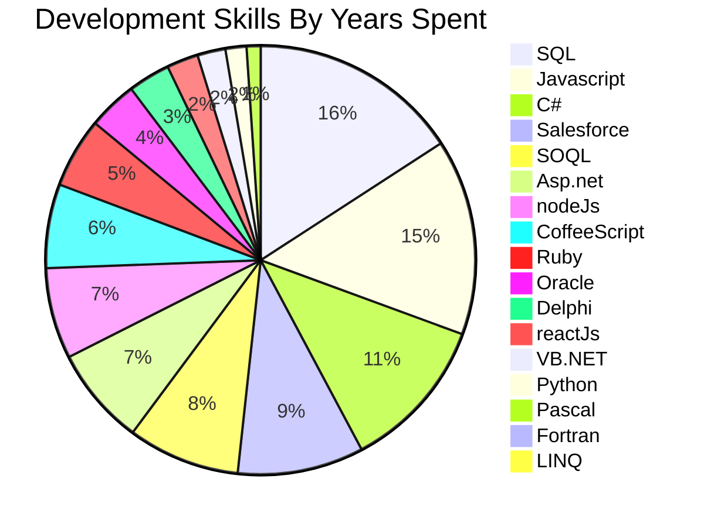
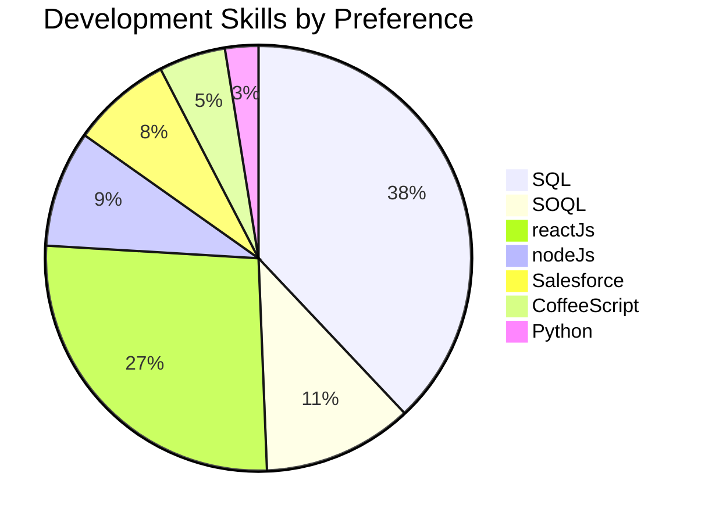

# Landscape

:construction: 

<code style="color : blue">Catching Up</code>
Catching   Up

${\color{orange}Catching \space Up}$

$${\color{red}Getting \space \color{lightblue}To Know \space \color{orange}Me}$$

:pencil2:

$${\color{red}Testing \space \color{green}Testing \space \color{blue}Testing}$$

> [!TIP]
> Helpful tips to come ....

> [!WARNING]
> Any Warnings would go here

## Simple alerts
> [!NOTE]
> This is a note.

> [!TIP]
> This is a tip. (Supported since 14 Nov 2023)

> [!IMPORTANT]
> Crucial information comes here.

> [!CAUTION]
> Negative potential consequences of an action. (Supported since 14 Nov 2023)

> [!WARNING]
> Critical content comes here.

