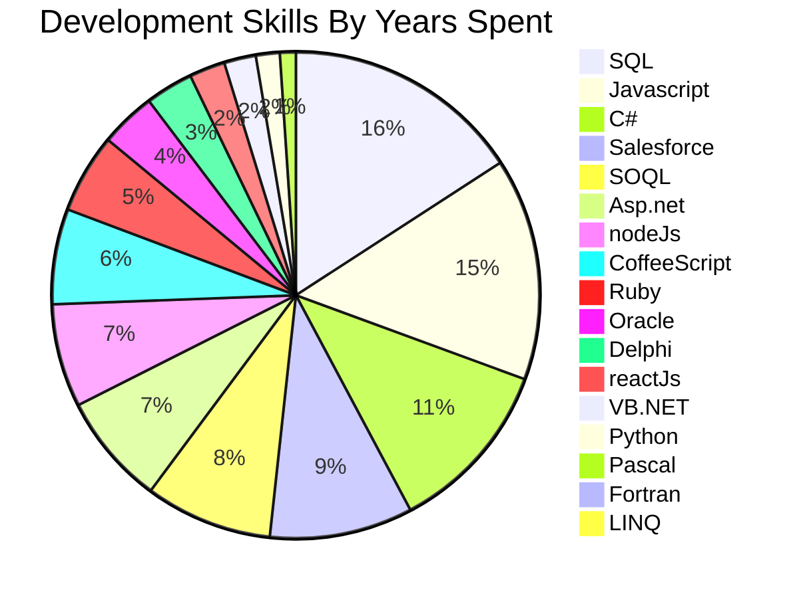
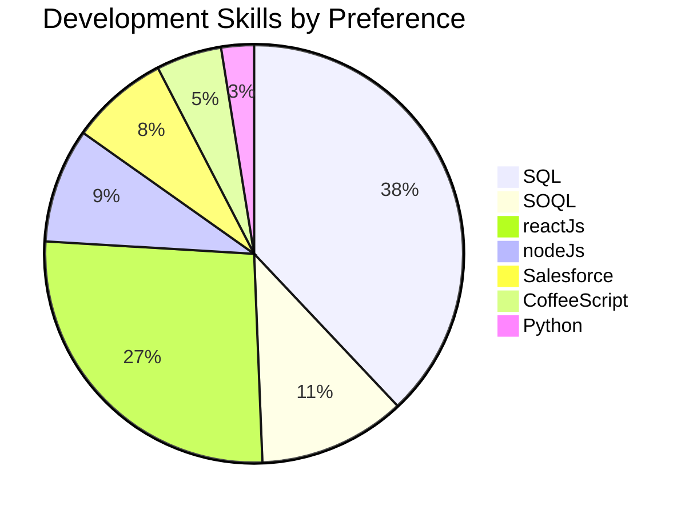

# Landscape

:construction: 

:poop:

:pencil2:

``` mermaid
pie title Development Skills By Years Spent
    "SQL" : 15
    "Javascript" : 14
    "C#" :  11
    "Salesforce" : 9
    "SOQL" : 8
    "Asp.net" : 7
    "nodeJs" : 6.5
    "CoffeeScript" : 6
    "Ruby" : 5
    "Oracle" : 3.5
    "Delphi" : 3
    "reactJs" : 2.25
    "VB.NET" : 2
    "Python" : 1.5
    "Pascal" : 1
    "Fortran" : 0.75
    "LINQ" : 0.5

    
```

```mermaid
pie title Development Skills by Preference
    "SQL" : 30
    "SOQL" : 9
    "reactJs" : 21
    "nodeJs" : 7
    "Salesforce" : 6
    "CoffeeScript" : 4
    "Python" : 2
```
